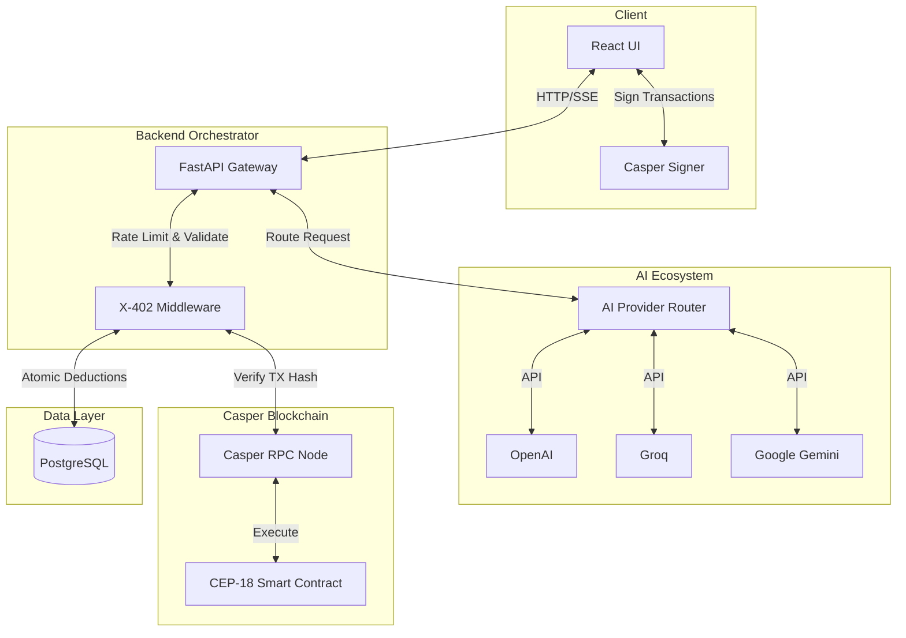
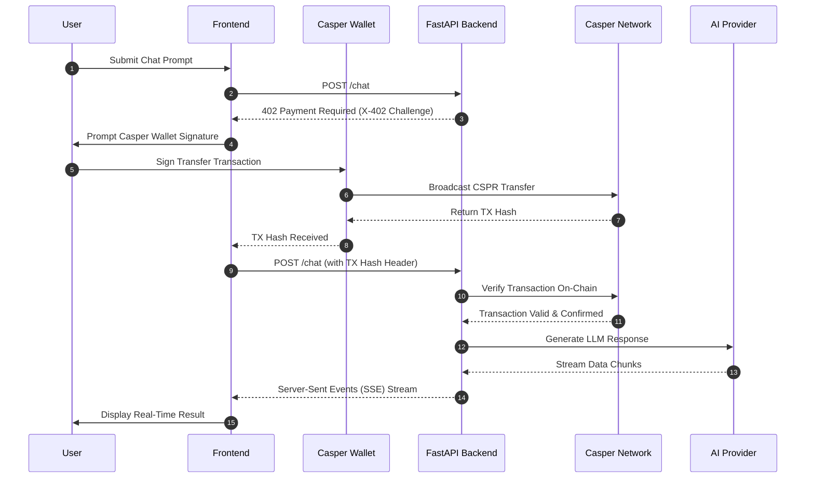
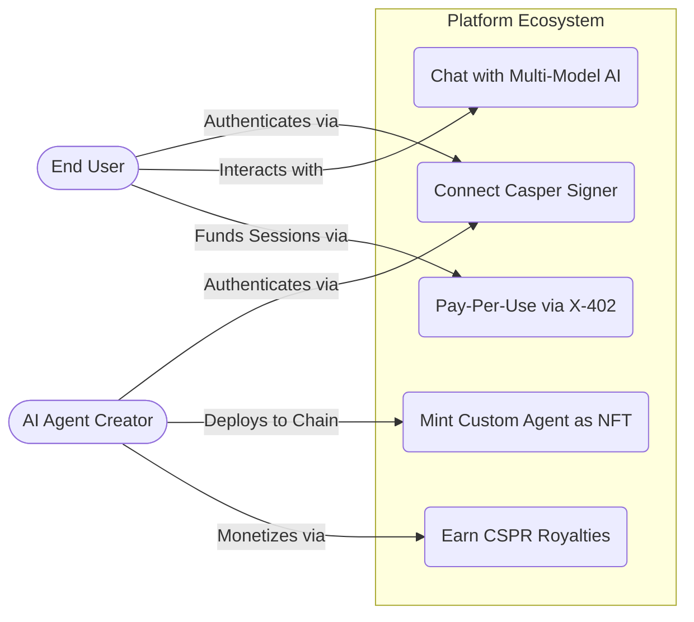

<div align="center">
  
  <h1 align="center">🚀 X-402 PayPerUseAI</h1>
  
  <p align="center">
    <b>The Future of Blockchain-Gated AI, One-Click NFT Generation & Custom AI Agent Marketplaces</b>
  </p>

  <p align="center">
    <a href="https://casper.network/">
      
    </a>
    <a href="https://react.dev/">
      
    </a>
    <a href="https://fastapi.tiangolo.com/">
      
    </a>
    <a href="https://openai.com/">
      
    </a>
  </p>

</div>

---

## 📑 Table of Contents

1. [Project Overview](#-1-project-overview)
2. [Key Features](#-2-key-features)
3. [Tech Stack](#-3-tech-stack)
4. [Architecture Diagram](#-4-architecture-diagram)
5. [Data Flow Diagram](#-5-data-flow-diagram)
6. [Use Case Diagram](#-6-use-case-diagram)
7. [Quick Start](#-7-quick-start)

---

## 📖 1. Project Overview

**X-402 PayPerUseAI** is a state-of-the-art decentralized platform bridging the gap between premium AI models and Web3 finance. Built on the **Casper Network**, we replace bloated monthly AI subscriptions with a frictionless **Pay-Per-Use** model powered by the native HTTP `402 Payment Required` standard.

Users connect their Casper Signer wallet, authorize a smart contract session, and get instantly charged *only for the exact tokens they consume*. No credit cards. No lock-ins. Switch between world-class models like Llama 3, GPT-4o, and Gemini 2.0 in a single conversation.

---

## ✨ 2. Key Features

* **🧠 Multi-Model Intelligence**: Switch seamlessly between **Llama 3.3**, **GPT-4o**, and **Gemini 2.0 Flash**. Change models mid-conversation without losing context.
* **⚡ X-402 Protocol Implementation**: Natively implements the HTTP `402 Payment Required` standard over the Casper Network for atomic, trustless pay-per-prompt execution.
* **⏱️ Stateful Postgres Sessions**: High-concurrency payment sessions are statefully tracked in a robust PostgreSQL database, allowing for load-balanced, multi-server scaling.
* **💎 NFT Agent Marketplace**: Transform custom AI agent prompts into permanent CEP-78 (NFT) assets. Monetize your prompt engineering skills and earn dynamic CSPR royalties.
* **🔗 Casper Network Native**: Built entirely using Casper smart contracts, CEP-18 tokens, and the Casper Wallet Signer SDK.

---

## 💻 3. Tech Stack

- **Frontend:** React, Vite, Tailwind CSS, Framer Motion
- **Backend:** Python, FastAPI, PostgreSQL (asyncpg)
- **Blockchain:** Casper Network, Casper Wallet Signer SDK, CEP-18 Tokens
- **AI Models:** Groq (Llama 3.3), OpenAI (GPT-4o), Google (Gemini 2.0 Flash)
- **Protocol:** X-402 (HTTP 402 Payment Required standard)

---

## 🏗️ 4. Architecture Diagram

The system architecture utilizes a React frontend connected to the Casper Wallet, interfacing with a highly-scalable FastAPI backend orchestrator. 



---

## 🔄 5. Data Flow Diagram

The sequence below illustrates the lifecycle of a single Pay-Per-Use request, showcasing the X-402 payment challenge and atomic on-chain verification.



---

## 👥 6. Use Case Diagram

PayPerUseAI supports two primary actors: the end consumer (User) and the prompt engineer (Creator).



---

## 🚦 7. Quick Start

### 1. Clone & Setup
```bash
git clone https://github.com/WPrasad99/X402_PayPerUseAi_Casper-Hackathon.git
cd X402_PayPerUseAi_Casper-Hackathon
```

### 2. Backend (FastAPI + PostgreSQL)
Ensure PostgreSQL is running locally, then initialize the backend:
```bash
cd src/backend
python -m venv venv
source venv/bin/activate
pip install -r requirements.txt
cp .env.example .env  # Add your API Keys
uvicorn app.main:app --reload --port 8000
```

### 3. Frontend (Vite + React)
```bash
cd src/frontend
npm install
npm run dev
```
Open `http://localhost:5173` in your browser and connect your Casper Wallet extension!
