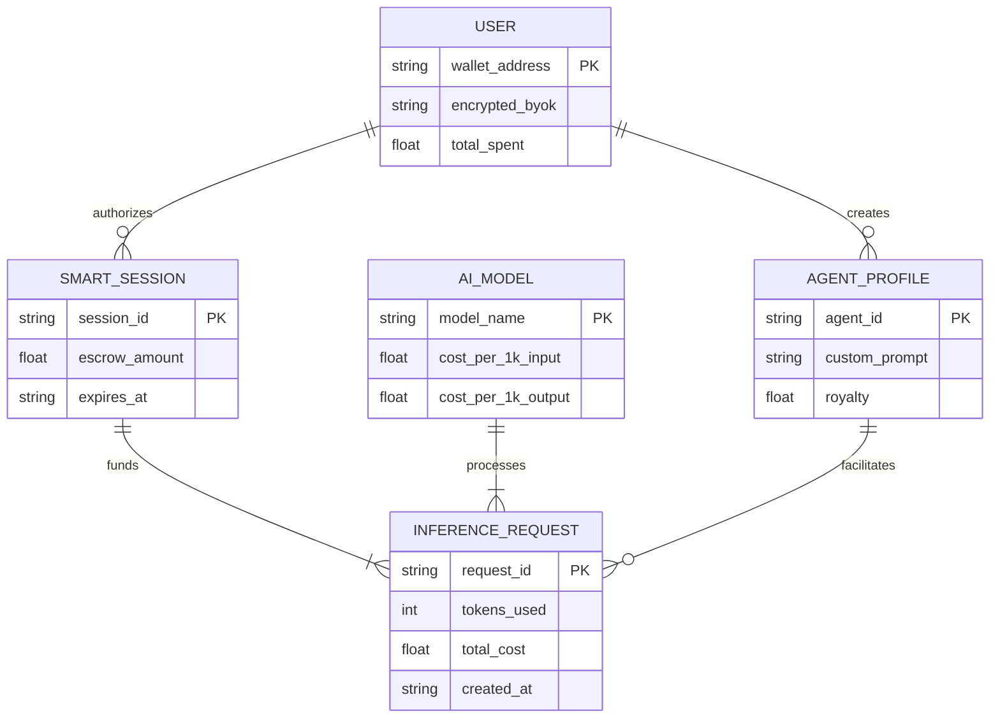
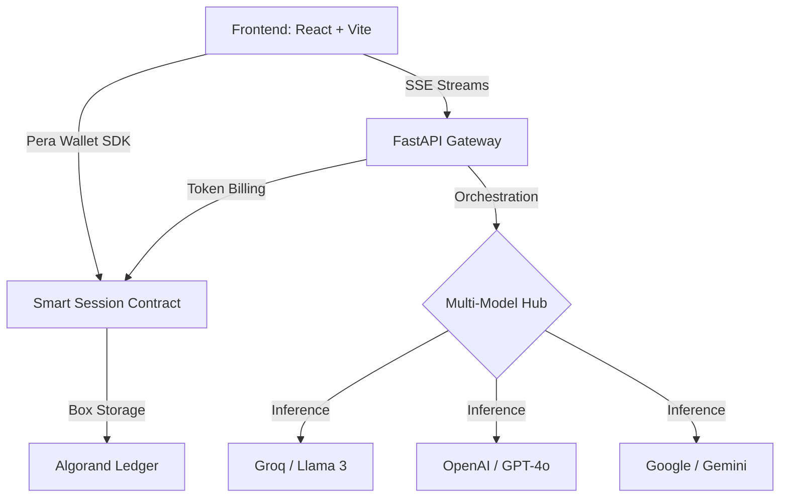

<div align="center">
  
  <h1 align="center">🚀 PayPerUseAI</h1>
  
  <p align="center">
    <b>The Future of Blockchain-Gated AI, One-Click NFT Generation & Custom AI Agent Marketplaces</b>
  </p>

  <p align="center">
    <a href="https://developer.algorand.org/">
      
    </a>
    <a href="https://react.dev/">
      
    </a>
    <a href="https://fastapi.tiangolo.com/">
      
    </a>
    <a href="https://openai.com/">
      
    </a>
  </p>

  <p align="center">
    
  </p>
</div>

---

## 📑 Table of Contents

1. [Project Overview](#-1-project-overview)
2. [Key Features](#-2-key-features)
3. [Quick Start (5 Mins)](#-3-quick-start-5-mins)
4. [System Architecture & ER Diagram](#-4-system-architecture--er-diagram)
5. [Token Pricing & Model Costs](#-5-token-pricing--model-costs)
6. [Configuration & Setup](#-6-configuration--setup)
7. [Deployment Guide](#-7-deployment-guide)

---

## 📂 Deep-Dive Documentation Index

Explore our high-fidelity, comprehensive guides for setup, security specifications, and smart contracts:

* 🛠️ **[Repo Setup Guide](docs/repo_setup_guide.md)** — Step-by-step local setup, environment configurations, and Vercel routing parameters.
* 🧠 **[System Architecture Document](docs/architecture_doc.md)** — Architectural sequence diagrams, secure AES-256 BYOK model, and real-time SSE streaming details.
* ⛓️ **[Smart Contract Specifications](docs/smart_contract_docs.md)** — PyTeal deployment specifications, global states, and Box Map escrow allocations on Algorand Testnet.
* 📄 **[Business & Product Whitepaper](docs/business_whitepaper.md)** — Target users, GTM strategy, DeFi revenue models, monetization hypotheses, and why Algorand.

---

## 📖 1. Project Overview

**PayPerUseAI** is a state-of-the-art decentralized platform bridging the gap between premium AI models and Web3 finance. We solve the issue of bloated monthly AI subscriptions by introducing a frictionless **Pay-Per-Use** model powered by the **Algorand Blockchain**. 

Users connect their wallets, authorize a smart contract session, and get instantly charged *only for the exact tokens they consume*. No credit cards. No lock-ins. Switch between world-class models like Llama 3, GPT-4o, and Gemini 1.5 in a single conversation.

### 📊 The Subscription Crisis: Why We Need X402 Pay-Per-Use

Traditional monthly subscriptions are highly inefficient, resulting in massive financial waste. PayPerUseAI replaces fixed fee models with direct on-chain utility.

<div align="center">

| 🛑 The Problem: Subscription Bloat | ⚡ The Cure: X402 Pay-Per-Use |
| --- | --- |
| **82%** of active users consume < 15% of monthly prompt quotas | Billed dynamically for exact token ingress + egress |
| **$20/mo** flat tax paid to centralized AI companies | Average query costs under **0.005 ALGO ($0.001)** |
| **54%** of annual SaaS seats go completely under-utilized | Zero lock-ins, zero monthly invoices, 100% self-custodial |
| Multi-subscription friction (switching between ChatGPT & Claude) | **Multi-Model Swapping** in a single workspace session |

</div>

> [!IMPORTANT]  
> According to recent SaaS usage studies:
> * 👥 **89% of Developers** prefer direct pay-per-token API structures over fixed monthly accounts.
> * 💸 **Over $180/year** is wasted by the average consumer on under-utilized AI subscriptions.

---

## ✨ 2. Key Features

* **🧠 Multi-Model Intelligence**: Switch seamlessly between **Llama 3.3 (Groq)**, **GPT-4o Mini**, **Gemini 1.5 Flash**, and **Qwen 2.5**. Change models mid-conversation without losing your chat context.
* **⚡ Seamless Real-Time Streaming**: Ultra-fast, character-by-character responses powered by Server-Sent Events (SSE). Experience Web2 performance with Web3 security.
* **⏱️ Pro Smart Sessions**: Authorize once, chat forever. Our optimized Smart Sessions use a **1 ALGO buffer** to enable "unlimited" prompting for 24 hours.
* **💎 1-Click NFT Minting**: Transform your AI interactions and images into permanent on-chain ARC-69 assets with one click.
* **🛒 Custom AI Agent Marketplace**: Host custom, secure AI agents with unique prompts. Monetize idle API keys by allowing others to run queries, earning dynamic pay-per-token royalty splits.

---

## 🚦 3. Quick Start (5 Mins)

### Live Demo Deployments
> 🔗 **Live Frontend:** **[https://pay-per-use-ai.vercel.app/](https://pay-per-use-ai.vercel.app/)**  
> 🔗 **Live Backend API:** **[https://pay-per-use-ai.onrender.com/docs](https://pay-per-use-ai.onrender.com/docs)**  

### Run Locally in 3 Steps
1. **Clone the Repo:**
   ```bash
   git clone https://github.com/WPrasad99/Pay-Per-Use-Ai.git
   cd Pay-Per-Use-Ai
   ```
2. **Run Backend (FastAPI):**
   ```bash
   cd src/backend
   python -m venv venv
   source venv/bin/activate  # Or .\venv\Scripts\activate on Windows
   pip install -r requirements.txt
   uvicorn app.main:app --reload --port 8000
   ```
3. **Run Frontend (Vite + React):**
   ```bash
   cd ../frontend
   npm install
   npm run dev
   ```
   Open `http://localhost:5173` in your browser.

---

## 🧠 4. System Architecture & ER Diagram

### Entity-Relationship (ER) Diagram
This diagram illustrates the relational data flow and ownership structures within the PayPerUseAI ecosystem, encompassing Users, Agents, Inference models, and On-chain Sessions.



### Platform Data Flow


---

## 💳 5. Token Pricing & Model Costs

PayPerUseAI operates strictly on a Pay-Per-Token model. Users are charged fractions of an ALGO directly corresponding to the exact amount of Input (Prompt) and Output (Completion) tokens processed by the selected AI model. No markup—just raw computation value.

| Model Provider | AI Model | Input Cost (per 1K Tokens) | Output Cost (per 1K Tokens) | Key Strengths |
|----------------|----------|----------------------------|-----------------------------|---------------|
| **Groq Cloud** | Llama 3.3 | **$0.0005** | **$0.0010** | Extreme Inference Speed, Reasoning |
| **Groq Cloud** | Qwen 2.5 | **$0.0003** | **$0.0007** | Multilingual Logic, Cost-Efficiency |
| **OpenAI** | GPT-4o Mini | **$0.0015** | **$0.0020** | High Intelligence, Code Generation |
| **Google** | Gemini 1.5 Flash | **$0.0008** | **$0.0012** | Massive Context Window, Vision |

> [!TIP]
> Custom AI Agents created by the community may include an additional royalty markup set by the creator (up to 10%), automatically distributed via smart contract logic on every interaction.

---

## ⚙️ 6. Configuration & Setup

### Tech Stack Specifications

<div align="center">
  
</div>

* **Python (3.10+):** Drives the low-latency asynchronous API Gateway orchestration.
* **JavaScript (ES6+):** Orchestrates state logic, persistent messaging, and wallet triggers in the client interface.
* **PyTeal / TEAL:** Governs the compile scripts and logic verification assertions for our Algorand BoxMap smart escrow contract.
* **W3C DID Standard:** Implements verifiable, decentralized credentials (`did:PayPerUseAI:<wallet>`).

### QR Verification System
Pay-Per-Use-AI features a decentralized **QR Verification System** utilizing the Pera Wallet Connect SDK to securely authenticate consumer sessions.
1. Frontend generates a localized, cryptographically unique QR verification code.
2. The consumer scans the QR code using their mobile Pera Wallet app.
3. The consumer signs the 1 ALGO escrow transaction via secure hardware execution, unlocking the frictionless chat capabilities.

---

## 🌐 7. Deployment Guide

### Vercel Routing Configuration
We have deployed the React client workspace to Vercel. To prevent `404` errors when reloading deep router paths (such as `/dashboard`, `/creator/*`, or `/shared/*`), the deployment includes a root `vercel.json` file to rewrite all client requests back to the master index page.

```json
{
  "cleanUrls": true,
  "trailingSlash": false,
  "rewrites": [
    {
      "source": "/(.*)",
      "destination": "/index.html"
    }
  ]
}
```
