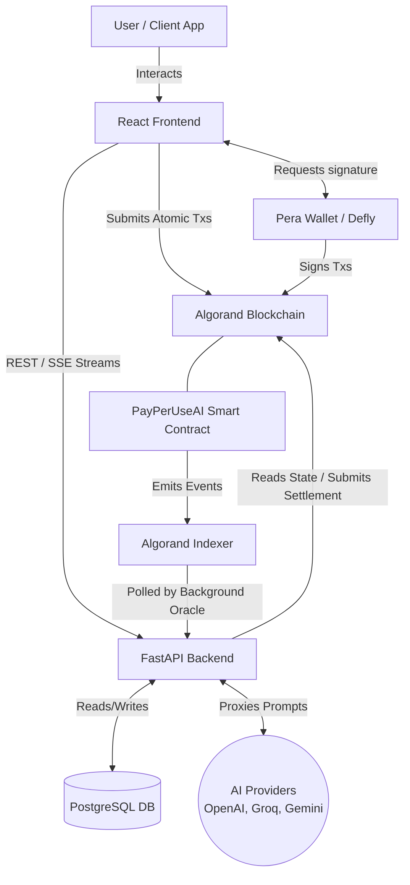
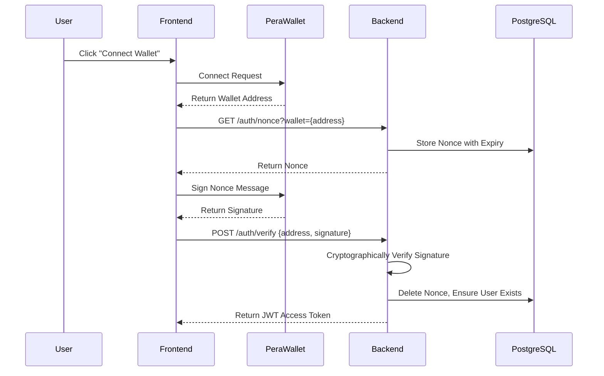
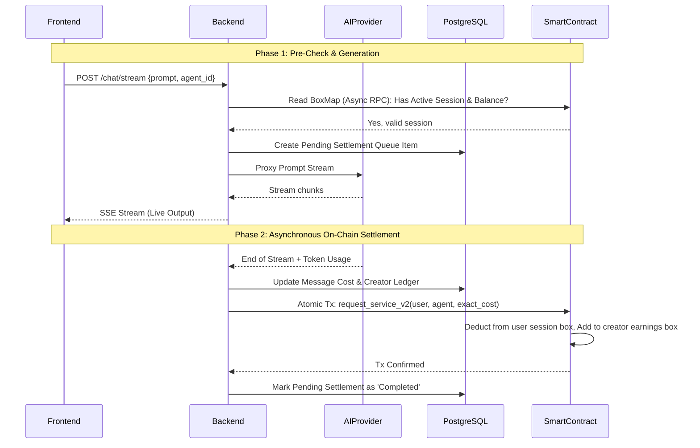
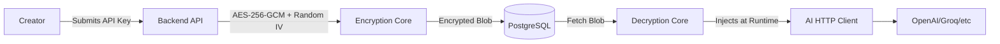

# PayPerUseAI System Architecture

This document provides a detailed, real-world architectural overview of the **PayPerUseAI** system, reflecting its production-grade design.

## 1. High-Level Architecture Overview

PayPerUseAI operates on a hybrid architecture combining a decentralized Web3 trust layer (Algorand Smart Contracts) with a high-performance Web2 backend (FastAPI + PostgreSQL). This hybrid approach ensures trustless financial transactions while maintaining lightning-fast, zero-latency AI streaming.

---

## 2. Component Deep Dive

### 2.1. Frontend Application (React)
- **Framework:** React / Vite.
- **Wallet Integration:** Integrates with Pera Wallet via `@perawallet/connect` to manage keys securely on the client side.
- **Core Responsibilities:**
  - Facilitates the "Sign In With Algorand" (SIWA) flow by requesting the user to sign a cryptographic nonce.
  - Constructs and submits Atomic Transaction Composers (ATC) directly to the Algorand network for `start_session` and `deposit`.
  - Consumes Server-Sent Events (SSE) from the backend for real-time AI token streaming.

### 2.2. Smart Contract (Algorand Python / AlgoKit)
- **State Storage:** Uses Algorand **Box Storage (BoxMaps)** to handle unlimited users without bloating global state.
  - `b_<address>`: Escrow Balance Box.
  - `sb_<address>`: Session Balance Box (Max authorized spend for the current active session).
  - `se_<address>`: Session Expiry Box (Unix timestamp).
  - `e_<address>`: Creator Earnings Box.
- **Trustless Execution:**
  - The backend **cannot** deduct more funds than the user authorized in the `sb_` box.
  - Users can manually trigger `end_session_and_withdraw` on-chain at any time to reclaim unspent escrow, bypassing the backend entirely if it goes offline.

### 2.3. Backend System (Python FastAPI)
- **Framework:** High-performance async Python via FastAPI and Uvicorn.
- **Routing Layer (`/app/routes/`)**:
  - `auth.py`: Verifies SIWA signatures and issues JWT access tokens.
  - `chat.py`: Handles SSE streaming. Enforces the **Two-Phase Locking Pattern**.
  - `creators.py`: Manages the marketplace, agents, and securely stores API keys.
- **Services Layer (`/app/services/`)**:
  - `ai_service.py`: Standardizes APIs for Groq, OpenAI, Gemini, and HuggingFace. Tracks token usage accurately for billing.
  - `algorand_service.py`: Interfaces with the Algorand blockchain (AlgoNode/Nodely). Signs transactions using the Platform Wallet for NFT minting and service settlement.
  - `event_listener.py`: A background daemon that polls the Algorand Indexer to map on-chain transactions to off-chain DB logs.
- **Core Engine (`/app/core/`)**:
  - `encryption.py`: AES-256-GCM encryption for "Bring Your Own Key" (BYOK) storage. Keys are never stored in plaintext.
  - `limiter.py`: `slowapi` rate-limiting to prevent DDOS.

### 2.4. Database (PostgreSQL)
- **Role:** Off-chain indexing, analytics, and complex querying. 
- **Key Tables:**
  - `users` / `creator_profiles`: Identity mapping.
  - `ai_agents` / `marketplace_reviews`: The decentralized AI agent store.
  - `creator_api_keys`: Encrypted BYOK storage.
  - `conversations` / `messages`: Chat history storage.
  - `pending_settlements`: A robust queue for the Two-Phase Locking settlement engine.
  - `creator_earnings_ledger`: Double-entry accounting mapping on-chain earnings to off-chain analytics.

---

## 3. Core System Flows

### 3.1. Sign In With Algorand (SIWA) Authentication Flow

### 3.2. Two-Phase Token Streaming & Settlement Flow
This is the core financial engine of PayPerUseAI. It ensures zero-latency streaming while guaranteeing the platform gets paid accurately per token.

### 3.3. Bring Your Own Key (BYOK) Encryption
To enable a decentralized marketplace where creators use their own API limits, keys are securely managed off-chain.

---

## 4. Scalability & Security Considerations

### 4.1. Concurrency & Non-Blocking Design
- **Async Architecture:** Both FastAPI and `asyncpg` ensure the backend can handle 10,000+ concurrent open SSE streaming connections without thread exhaustion.
- **Multi-Node Fallback:** Blockchain RPC calls automatically rotate across free public nodes (AlgoNode, Nodely) via `httpx` to prevent rate-limiting bottlenecks.

### 4.2. Security Posture
- **Double-Spend Protection:** The backend relies entirely on the Smart Contract for truth. If a user maliciously spams prompts, the backend's Two-Phase Lock tracks pending settlements. If the user depletes their on-chain balance, the `request_service_v2` atomic transaction fails, and the backend instantly terminates their active session locally.
- **Wallet Failsafes:** Validates that the `wallet_address` present in the HTTP Request explicitly matches the cryptographic signature inside the `JWT` payload, preventing token replay attacks across different wallets.
- **Encrypted Secrets:** The `API_KEY_ENCRYPTION_SECRET` is never hardcoded. If the environment variable is missing, the backend refuses to boot via a `RuntimeError`, guaranteeing production security.
