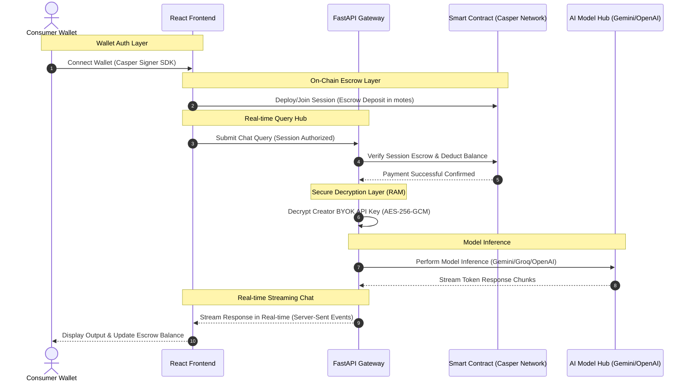

# <div align="center">🧠 Pay-Per-Use-AI: System Architecture Document</div>

<div align="center">


</div>

---

## 🏛️ 1. High-Level Architectural Diagram

The system comprises three core layers: **Client Frontend (React)**, **FastAPI Orchestration Gateway**, and the **Casper Network Testnet Ledger**, interacting in a hybrid layout.



---

## 🔐 2. Secure BYOK (Bring Your Own Key) Cryptography

To circumvent rate limiting and ensure self-sovereignty, Pay-Per-Use-AI employs a **Bring Your Own Key (BYOK)** structure.

> [!CAUTION]
> **API Key Safety is our Highest Priority**
> At no point is a creator's raw API key ever saved in plain text, stored on a persistent database disk, or output in server logs. All decryptions happen on-the-fly directly inside isolated backend RAM and are immediately wiped.

### Key Encryption Workflow (AES-256-GCM)
1. **Creation**: The Creator enters their display credentials and pastes their raw API Key inside the unified **Identity** step.
2. **Encryption**: The React client securely posts the key to the backend. The backend encrypts the key using standard **AES-256-GCM** encryption with the platform's canonical `API_KEY_ENCRYPTION_SECRET`.
3. **Decentralized Storage**: The encrypted key (ciphertext, nonce, and tag) is serialized and stored on-chain linked to the creator's wallet.
4. **Execution Decryption**: When a consumer initializes an AI session with this creator's agent, the backend pulls the encrypted string from the ledger, decrypts it on-the-fly inside RAM, executes the model query, and immediately discards the raw key, preventing it from ever being cached on disk or logged.

```text
  Raw API Key ──► [ Backend RAM ] ──► Encrypt (AES-256-GCM) ──► Encrypted String
                        ▲                                           │
                        │                                           ▼
                  Platform Secret                              Saved On-Chain
```

---

## ⚡ 3. Real-Time SSE (Server-Sent Events) Chat Hub

Rather than using long-polling or bulky WebSockets, our system delivers character-by-character responses with ultra-low latency using **Server-Sent Events (SSE)**.

### Performance Pipeline
* **Pipelined Authentication**: The backend acts as a streaming gateway. The moment the API query is submitted, it validates the caller's smart session escrow buffer.
* **Non-Blocking Inference Chunks**: As the foundation model returns token chunks (e.g. Gemini 2.0 Flash or GPT-4o), they are instantly serialized into standard `text/event-stream` chunks.
* **On-Chain Settlement**: Once the stream concludes, the exact token count consumed (input + output) is computed. The backend executes a settlement transaction on the Casper Network smart contract, deducting the exact token cost from the user's session escrow.

---

## 💰 4. Session Escrow Buffers (Uninterrupted UX)

> [!IMPORTANT]
> Traditional blockchain applications require a wallet signature for every single message, which completely destroys the chat user experience. Pay-Per-Use-AI introduces **High-Performance Smart Sessions** to bypass this friction entirely.

* **The 1 CSPR Escrow Buffer**: Upon starting a session, the user signs **once** via Casper Signer to lock a 1 CSPR buffer inside the contract's secure BoxMap escrow.
* **Frictionless Prompts**: For the next 24 hours, the user can prompt the AI continuously without ever seeing another wallet signature popup!
* **Transparent Settlement**: The backend calculates the motes token costs in the background and settles them directly against the session escrow.
* **Self-Governed Release**: The user can click "End Session" at any time, returning any unspent escrow balance back to their wallet instantly.

---

## 🛡️ 5. X402 Protocol: Casper Network Pay-Per-Use Billing Standard

Pay-Per-Use-AI implements a custom **X402 protocol** (our proprietary billing specification for decentralized payment-gated APIs on Casper Network L1) to govern query authentications.

### The X402 Billing Protocol in Action
1. **Request Interception**: Every incoming chat or image request to `/query` or `/image` is parsed for session authorization payload parameters.
2. **On-Chain Balance Check**: The backend verifies the user's active session escrow balance.
3. **The 402 HTTP Exception**: If the session is expired or does not have sufficient CSPRs to cover the next execution cost, the backend raises a strict `HTTP 402 Payment Required` exception:
   ```python
   raise HTTPException(
       status_code=402, 
       detail="On-chain verification denied: Insufficient session balance"
   )
   ```
4. **Frontend Challenge Resolution**: The frontend React app catches the `402` status code. Instead of breaking the page or crashing, it triggers a custom **Escrow Recharge Challenge**. The user is prompted to sign a quick Casper Signer top-up transaction to deposit additional CSPRs into their session Box, immediately resolving the billing block and resuming chat oCaspertions.
